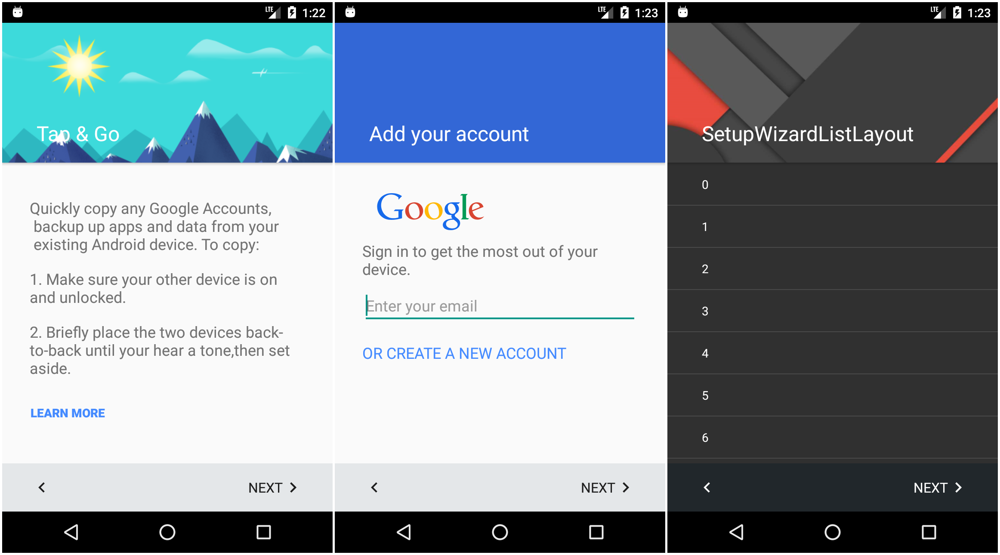

## SetupWizardLayout

SetupWizardLayout is from [AOSP SetupWizard](https://android.googlesource.com/platform/frameworks/opt/setupwizard/)

Android 原生设置向导布局, 代码来自 [AOSP SetupWizard](https://android.googlesource.com/platform/frameworks/opt/setupwizard/)

## Screenshots


## Download

### Gradle

Step 1. Add the JitPack repository to your build file
```
allprojects {
    repositories {
        ...
        maven { url 'https://jitpack.io' }
    }
}
```
Step 2. Add the dependency
```
dependencies {
    compile 'com.github.User:Repo:Tag'
}
```

### Maven
Step 1. Add the JitPack repository to your build file
```
<repositories>
    <repository>
        <id>jitpack.io</id>
        <url>https://jitpack.io</url>
    </repository>
</repositories>
```
Step 2. Add the dependency
```
<dependency>
    <groupId>com.github.User</groupId>
    <artifactId>Repo</artifactId>
    <version>Tag</version>
</dependency>
```

## Usage

`Activity.java`  
```
SetupWizardLayout layout = (SetupWizardLayout) findViewById(R.id.setup);
layout.setHeaderText(getTitle());
layout.setIllustration(getResources().getDrawable(R.drawable.suw_layout_background));
layout.setIllustrationAspectRatio(4f);
layout.setProgressBarShown(true);
layout.getNavigationBar().setNavigationBarListener(new NavigationBar.NavigationBarListener() {
    @Override
    public void onNavigateBack() {
        
    }

    @Override
    public void onNavigateNext() {
        
    }
});
```

`layout.xml`  
```
<com.android.setupwizardlib.SetupWizardLayout
    xmlns:android="http://schemas.android.com/apk/res/android"
    xmlns:tools="http://schemas.android.com/tools"
    android:id="@+id/setup"
    android:layout_width="match_parent"
    android:layout_height="match_parent">
    
    // add your layout

</com.android.setupwizardlib.SetupWizardLayout>
```

`AndroidManifest.xml`
```
<activity
    android:name="com.meiji.setupwizardDemo.SecondActivity"
    android:theme="@style/SuwThemeMaterial.Light"/>
```